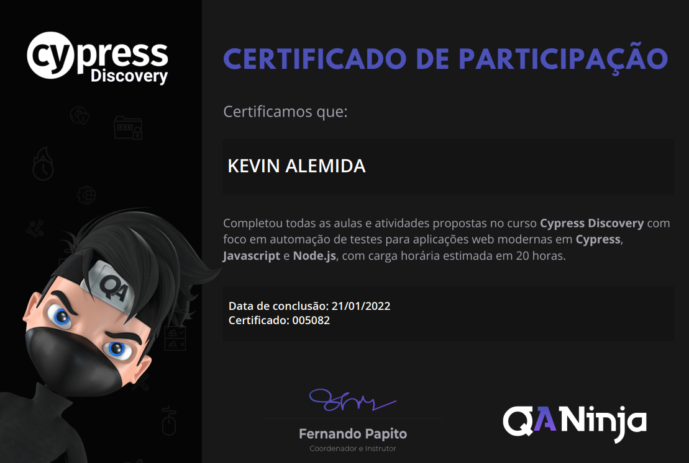

# Projeto de testes de aceitação do app BugerEats

Este repositório é de uma automação construída durante o **Cypress Discovery**, curso oferecido pela [QA Ninja]("https://qaninja.academy" "Site da QA Ninja"). O projeto foi construído utilizando o cypress e testa o site da "BugerEats", seguindo as boas práticas de desenvolvimento e ainda utilizando o GitHub Actions como ferramenta de Continuous Testing.

# Tecnologias utilizadas
## Codificação
- Cypress
- JavaScript
- NodeJS
## Continuous Testing
- GitHub Actions

# Autor

Feito por: Kevin Almeida | [<a href="https://www.linkedin.com/in/kevin-almeida-desenvolvedor/">Veja meu Linkedin</a>]
 
Créditos: QA Ninja | [<a href="https://www.youtube.com/qaninja">Veja o canal do youtube da QA Ninja</a>]

# Certificado de conclusão
